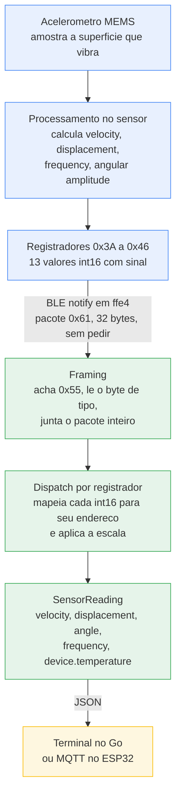
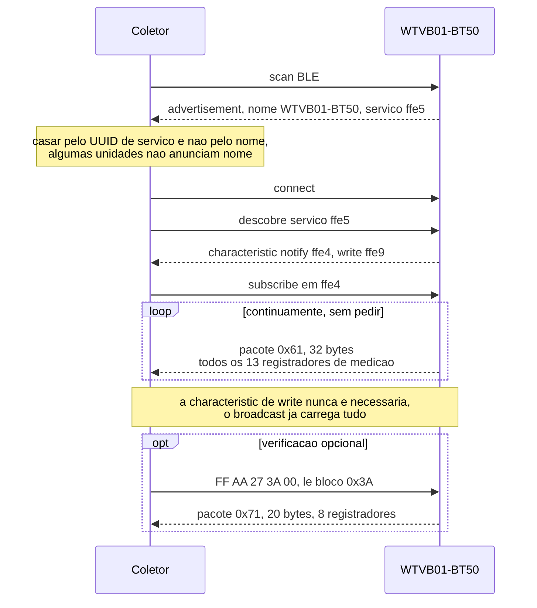
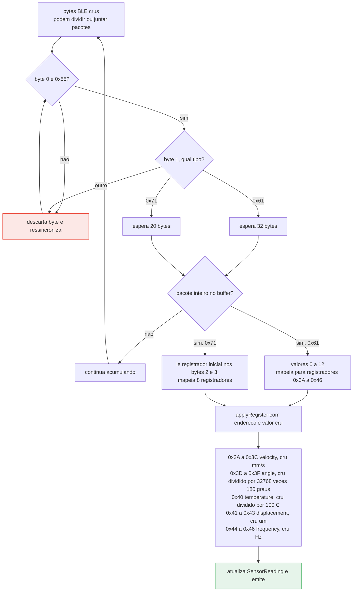
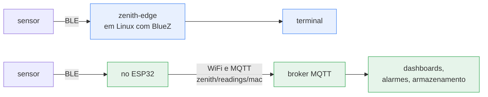

# Arquitetura e fluxo de dados

Dois coletores leem o mesmo sensor e emitem o mesmo schema JSON. Qual
deles você usa depende de haver ou não uma máquina Linux junto ao
equipamento.

- **Coletor Go** (`cmd/zenith-edge`) — roda em Linux via BlueZ. Usado
  para desenvolvimento, trabalho de protocolo e captura de fixtures.
- **Nó ESP32** (`firmware/esp32-zenith-node`) — hardware autônomo, publica
  em MQTT por WiFi. Usado em campo.

O decoder é a mesma lógica nos dois, portada linha a linha, e ambos são
testados contra os mesmos bytes capturados do sensor.

## O caminho completo, ponta a ponta

Azul é o trabalho do próprio sensor, verde o do coletor, amarelo a saída.

**O sensor faz o processamento de sinal.** Quando o dado chega ao
coletor já é velocity, displacement e frequency — o coletor nunca vê
amostras de aceleração bruta e não faz FFT nenhuma.

## Sequência de conexão

As medições **não** estão no advertisement BLE, só os UUIDs de serviço
estão, então conectar é obrigatório. Escuta passiva não funciona.

O caminho de leitura de registrador existe só para verificar o decoder.
Como `0x61` e `0x71` são codificações independentes dos mesmos
registradores, decodificar os dois e comparar é um teste de corretude que
**não precisa de referência externa** — foi assim que o layout do pacote
foi provado, e isso roda como teste nas duas implementações.

## Dentro do decoder

Os dois tipos de pacote passam por um único dispatch por endereço de
registrador, em vez de dois layouts paralelos, porque a captura mostrou
que os 13 primeiros valores do broadcast são idênticos aos registradores
`0x3A`–`0x46`.

O decoder **acumula**: um pacote `0x61` atualiza todos os campos de uma
vez, enquanto uma leitura `0x71` atualiza só os oito registradores do seu
bloco, deixando o resto no último valor conhecido.

### A cilada dos 20 bytes

O SDK genérico BWT901 da WitMotion fixa 20 bytes para **os dois** tipos
de pacote. Está certo para `0x71` e errado para o `0x61` do WTVB01, que
tem 32 bytes.

Isso é pior que um off-by-one comum porque decodificar um pacote de 32
bytes como 20 **não quebra nem gera lixo óbvio** — lê os campos errados e
produz números *plausíveis*. Na primeira execução reportou um "angle" de
13,35°, que na verdade era o registrador de temperatura lido no offset
errado. Só foi pego comparando contra as leituras de registrador.

## Formas de deploy

A linha de cima é o caminho de desenvolvimento, a de baixo o deploy em
campo. Os dois emitem o mesmo JSON, então qualquer consumidor a jusante
funciona com os dois sem saber qual produziu a leitura.

## Por que o gargalo é o sensor, não o link

As notificações BLE chegam a cada 20–50 ms, mas os registradores de
vibração atualizam bem mais devagar — nas capturas os valores de vibração
ficaram parados por dezenas de pacotes enquanto só a temperatura e o
contador final se moviam. O sensor calcula as métricas de vibração sobre
uma janela interna.

Consequências:

- Publicar mais rápido que ~1 Hz envia duplicatas. O nó ESP32 agrupa em
  `PUBLISH_INTERVAL_MS` (1 s por padrão).
- Os timestamps marcam quando o coletor decodificou o pacote, não quando
  o sensor amostrou a superfície.
- Perder um pacote não custa nada; o próximo carrega o estado completo de
  novo. Não há codificação delta para ressincronizar.
