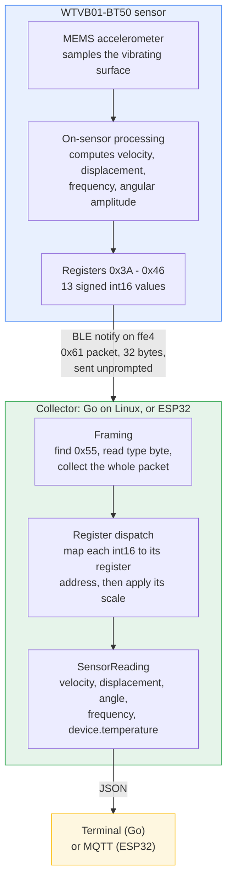
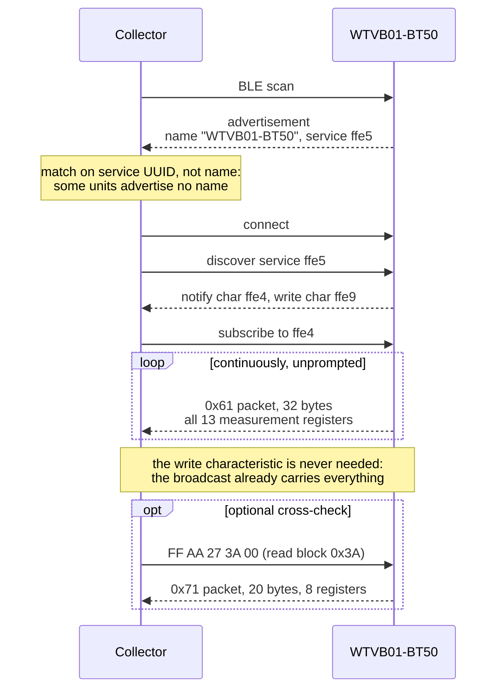
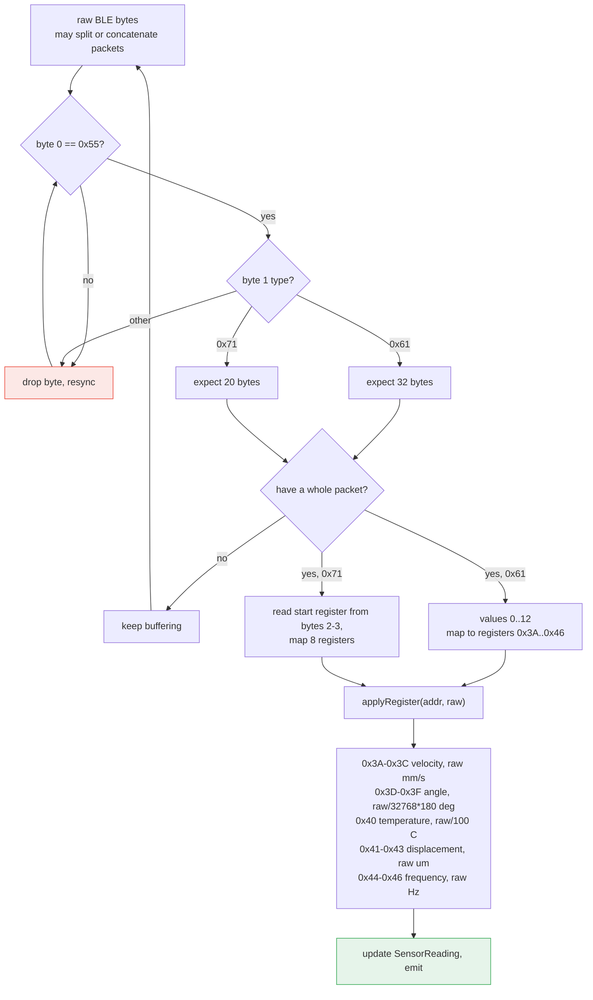
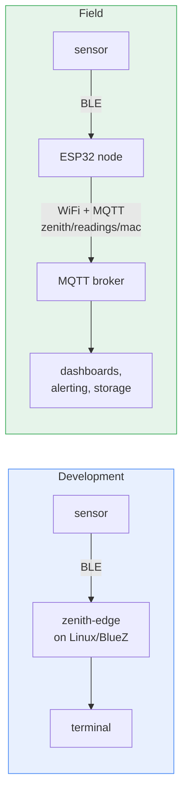

# Architecture and data flow

Two collectors read the same sensor and emit the same JSON schema. Which
one you deploy depends on whether a Linux box is available at the
machine.

- **Go collector** (`cmd/zenith-edge`) — runs on Linux via BlueZ. Used
  for development, protocol work, and capturing fixtures.
- **ESP32 node** (`firmware/esp32-zenith-node`) — standalone hardware,
  publishes to MQTT over WiFi. Used in the field.

The decoder is the same logic in both, ported line for line, and both
are tested against the same captured sensor bytes.

## The whole path, end to end

The sensor does the signal processing. By the time anything reaches the
collector it is already velocity, displacement and frequency — the
collector never sees raw acceleration samples and does no FFT.

## Connection sequence

The measurements are not in the BLE advertisement, only the service
UUIDs are, so a connection is mandatory. Passive sniffing does not work.

The optional read-back path exists only to verify the decoder. Because
`0x61` and `0x71` are independent encodings of the same registers,
decoding both and comparing is a correctness check that needs no
external reference — this is how the packet layout was proven, and it
runs as a test in both implementations.

## Inside the decoder

Both packet types feed one register-address dispatch rather than two
parallel field layouts, because capture showed the broadcast's first 13
values are byte-identical to registers `0x3A`-`0x46`.

The decoder accumulates: a `0x61` packet refreshes every field at once,
while a `0x71` read-back refreshes only the eight registers in its
block, leaving the rest at their last known value.

### The 20-byte trap

WitMotion's generic BWT901 SDK hardcodes a 20-byte packet for **both**
types. That is correct for `0x71` and wrong for the WTVB01's `0x61`,
which is 32 bytes.

This matters more than a normal off-by-one because decoding a 32-byte
packet as 20 bytes does not crash or produce obvious garbage — it reads
the wrong fields and yields *plausible-looking* numbers. In our first
run it reported an "angle" of 13.35°, which was actually the temperature
register read at the wrong offset. It was caught only by comparing
against the register read-backs.

## Deployment shapes

Both emit the same JSON, so anything downstream can consume either
without knowing which produced it.

## Why the sensor is the bottleneck, not the link

BLE notifications arrive roughly every 20-50 ms, but the vibration
registers update far more slowly — in captures the vibration values held
steady across dozens of packets while only temperature and the trailing
counter moved. The sensor computes vibration metrics over an internal
window.

Consequences:

- Publishing faster than about 1 Hz sends duplicates. The ESP32 node
  coalesces to `PUBLISH_INTERVAL_MS` (1 s by default).
- Timestamps mark when the collector decoded a packet, not when the
  sensor sampled the surface.
- A single missed packet costs nothing; the next one carries the full
  state again. There is no delta encoding to resynchronize.
